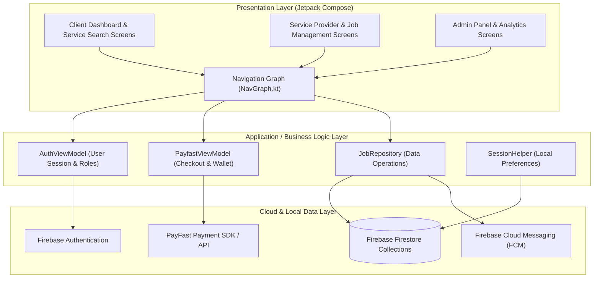
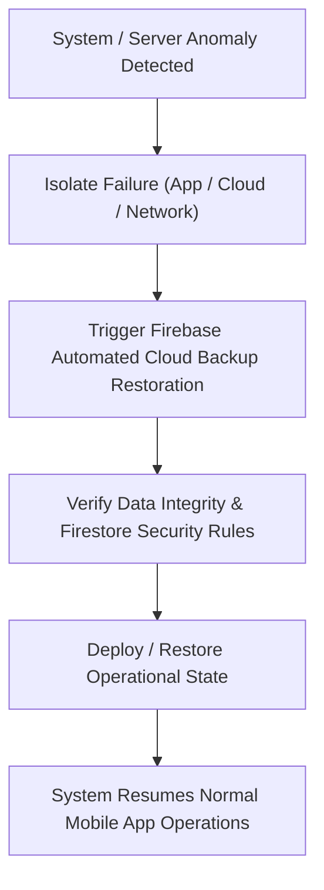
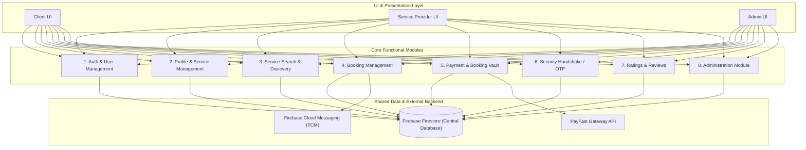
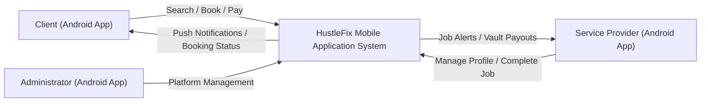
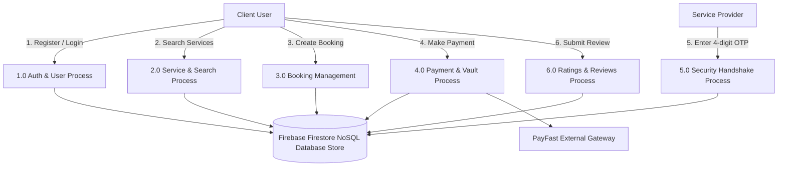
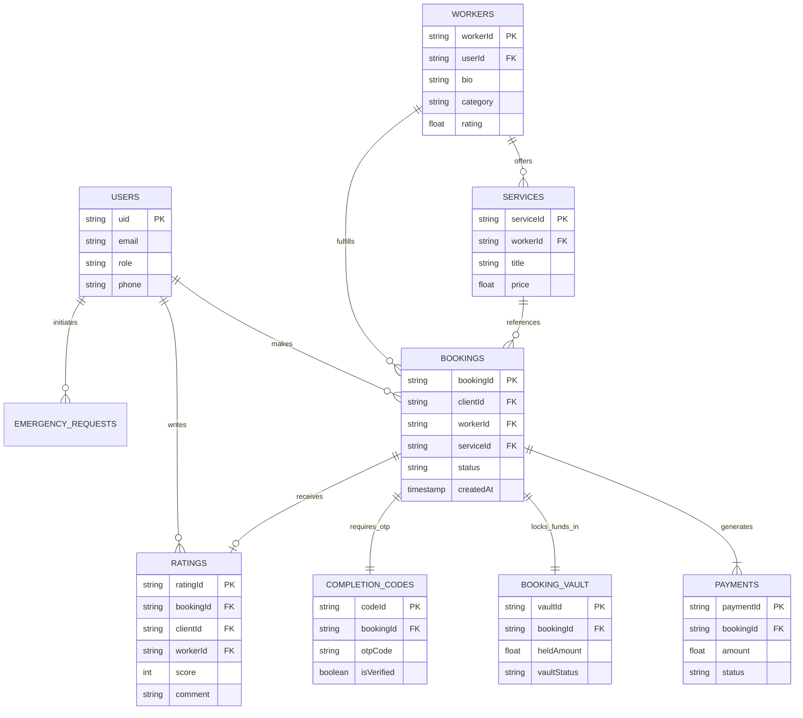
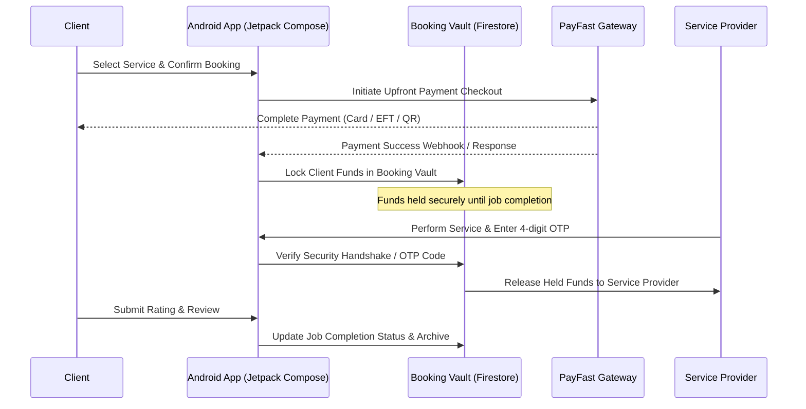

# HustleFix - Detailed System Design Document (Fixed & Android-Aligned)

To be completed by Coordinator
Date Received: _____/_____/_______
Signature: ______________________
Coordinator Notes:
________________________________________
________________________________________
________________________________________

## REVISION HISTORY
| REVISION NUMBER | DATE | COMMENT |
| :--- | :--- | :--- |
| 1.0 | 15/09/2026 | Completed HustleFix Detailed System Design Document (Android Mobile Application Architecture) |

---

## TABLE OF CONTENTS
1. [DOCUMENT OVERVIEW](#1-document-overview)
2. [SYSTEM OVERVIEW](#2-system-overview)
3. [HARDWARE DESIGN](#3-hardware-design)
4. [SOFTWARE DESIGN](#4-software-design)
5. [DATA AND DATABASE / FILES](#5-data-and-database--files)
6. [SYSTEM INTERFACES](#6-system-interfaces)
7. [SYSTEM PERFORMANCE](#7-system-performance)
8. [GLOSSARY / TERMINOLOGY](#8-glossary--terminology)
9. [REFERENCES](#9-references)

---

## 1. DOCUMENT OVERVIEW

This is the Detailed System Design Document for **HustleFix**, an Android mobile service marketplace application. It provides the technical design of the system and explains how the mobile application, software components, cloud database, interfaces, hardware environment, and payment workflow are designed to meet project requirements.

This document has been developed by the HustleFix project team for the HustleFix Android Service Marketplace Application. It was developed from approved project requirements, system specifications, architecture/design work, use-case models, database design, user-interface mock-ups, and project documentation. It is intended to satisfy identified customer requirements, objectives, and expectations.

### SCOPE
The SDD relates to the HustleFix Android mobile application. The system is installed and accessed on **Android smartphones and tablets** running supported versions of the Android operating system. The design covers the mobile client application (built using Jetpack Compose, Kotlin, and Java), server-side backend services (**Firebase Firestore, Authentication, and Cloud Functions**), secure Internet connectivity, and PayFast payment integration. Development and testing are performed using Android Studio and standard Android development toolchains.

### AUDIENCE
The intended audience includes the HustleFix development team, project manager, business analyst, testers, database designers, administrators, project supervisor/lecturer, and other stakeholders. Users of this document are expected to have basic knowledge of mobile application development, cloud databases, software engineering principles, and UML/ERD modelling. The design assumes that users have Android mobile devices with Internet access.

### RELATED DOCUMENTATION
Related documentation includes the HustleFix project proposal/system specification, requirements documentation, System Architecture Document (SAD), use-case diagrams, Data Flow Diagrams (DFDs), Entity Relationship Diagram (ERD), user-interface designs, test plans and test results, and other approved project documentation maintained by the project team.

### DOCUMENT CONVENTIONS
The document uses standard software design terminology and UML-based modelling. Use-case and process diagrams represent actors, system functions, and interactions. DFD notation represents data movement between users, processes, and data stores. ERD notation represents entities, attributes, and relationships. Standard headings and tables are used to organize technical information.

---

## 2. SYSTEM OVERVIEW

This section summarizes the overall design of HustleFix and explains the main system components, users, interfaces, and technical environment.

### DESCRIPTION
HustleFix is an Android service marketplace mobile application that acts as a digital middleman between clients who need services and service providers who offer services. Clients can register and log in, search for services and providers, view profiles, compare prices and ratings, make bookings, manage service requests, and track urgent/emergency jobs. Service providers can create profiles, advertise their skills and services, provide pricing information, and manage bookings. Administrators manage users, services, bookings, payments, and other platform information. The system includes an upfront payment process where the client pays via PayFast or Wallet, and the amount is held securely in the **Booking Vault** until job-completion confirmation is successfully verified.

### SYSTEM ARCHITECTURE
HustleFix uses a **Mobile Client-Server Architecture**. Users access the platform via the native Android mobile application installed on their smartphones or tablets.
* **Presentation & Application Layer:** Runs locally on the client's Android device, utilizing Jetpack Compose for UI rendering, ViewModels for state management, and repository layers for business logic.
* **Data & Backend Layer:** Hosted in the cloud via **Firebase** (Firebase Authentication for user management, Firebase Firestore for real-time document storage, and Cloud Functions for backend logic/notifications).
* **Payment Integration:** Communicates securely with PayFast payment gateway APIs.

```mermaid
graph TB
    subgraph Client Device [Android Mobile Device - Kotlin & Jetpack Compose]
        direction TB
        UI["UI Layer<br/>(Client, Service Provider, & Admin Screens)"]
        VM["Application & Business Logic Layer<br/>(ViewModels, NavGraph, JobRepository)"]
        UI --> VM
    end

    subgraph Cloud Backend [Firebase Cloud Infrastructure]
        direction TB
        Auth["Firebase Authentication<br/>(User Identity & Role Management)"]
        Firestore[("Firebase Firestore<br/>(NoSQL Document Database:<br/>Users, Workers, Services, Bookings,<br/>Booking Vault, Ratings, Messages)")]
        Functions["Firebase Cloud Functions<br/>(Serverless Backend Logic)"]
        FCM["Firebase Cloud Messaging<br/>(Push Notifications)"]
    end

    subgraph External Gateway
        PayFast["PayFast Payment Gateway<br/>(Credit Card, Instant EFT, QR Code)"]
    end

    VM -->|HTTPS / Firebase Auth SDK| Auth
    VM -->|Firestore SDK / Realtime Queries| Firestore
    VM -->|Secure Checkout Request| PayFast
    Firestore -->|Triggers| Functions
    Functions -->|Dispatches| FCM
    FCM -->|Push Alert| Client Device
```
*Figure 1: Detailed HustleFix Android Client-Server System Architecture*

### SOFTWARE ARCHITECTURE
The software architecture follows a layered design separating the user interface, view models, business logic, data management, and external-service integration:
1. **Presentation Layer:** Jetpack Compose screens, reusable components, and navigation graphs (`NavGraph.kt`) handling user interaction across Client, Service Provider, and Admin roles.
2. **Application / Business Logic Layer:** ViewModels (`AuthViewModel`, `PayfastViewModel`, etc.) and repositories (`JobRepository`) handling authentication, profile management, service searching, booking state machines, payment rules, completion confirmation, ratings, and administration.
3. **Data Layer:** Persistent records stored in Firebase Firestore collections and local session management (`SessionHelper`).
4. **External Services:** Integration with PayFast payment processing and Firebase Cloud Messaging (FCM) for push notifications.


*Figure 2: Detailed Layered Software Architecture and Component Interaction*

### HARDWARE ARCHITECTURES
The hardware architecture consists of standard Android user devices and cloud server infrastructure:
* **End-User Devices:** Android smartphones and tablets running supported versions of Android OS with Internet connectivity (Wi-Fi or mobile data).
* **Development & Server Infrastructure:** Developer workstations running Android Studio (minimum Intel Core i5 processor, 8 GB RAM, SSD) and cloud-hosted Firebase servers providing scalable processing, memory, storage, and secure backend database operations.

---

## 3. HARDWARE DESIGN

HustleFix is a native Android mobile application and therefore does not require specialised physical hardware. The hardware design focuses on Android mobile devices, developer workstations, cloud hosting infrastructure, storage, network connectivity, and backup facilities.

### HARDWARE COMPONENTS
The main hardware components are Android mobile client devices, developer workstations, cloud server infrastructure, storage, and networking equipment. Developer workstations must provide sufficient CPU, memory, and storage to run Android Studio, build tools, and Android emulators smoothly. End-user devices must be capable of running the compiled Android application (`.apk`) and maintaining an active Internet connection.

### COMPUTER SYSTEMS
* **Developer Systems:** Windows, macOS, or Linux workstations equipped with multi-core processors (e.g., Intel Core i5/i7 or Apple Silicon), at least 8 GB of RAM (16 GB recommended), and SSD storage for Android Studio and SDK tooling.
* **User Systems:** Android smartphones and tablets equipped with touch displays, internal memory, processors capable of running modern Android UI frameworks, and built-in network interfaces.
* **Server Systems:** Cloud-based server instances managed by Firebase / Google Cloud Platform ensuring high availability, automatic scaling, and secure data backups.

### PERIPHERALS
Standard mobile device peripherals such as multi-touch capacitive touchscreens, built-in cameras (for profile pictures, service media, and scanning QR codes), GPS/location sensors (for live tracking and location-based service search), microphones, speakers, and network adapters (Wi-Fi / cellular) are utilized.

### NETWORKS
The application communicates over the Internet using standard TCP/IP networking, cellular data (4G/5G), and Wi-Fi. HTTPS (TLS 1.2/1.3) is enforced for all communications between the Android application, Firebase backend services, and external payment gateways to protect data in transit.

### PROJECT-SPECIFIC HARDWARE ITEMS
No custom or project-specific hardware items (such as external sensors, transducers, robotics, or custom enclosures) are required; standard mobile device hardware sensors (GPS and Camera) are utilized.

### HARDWARE INTEGRATION
* **Logical Design:** Android Mobile App (Client) → Internet (Wi-Fi / Cellular) → Firebase Cloud Backend (Firestore, Auth, Functions) & PayFast Payment Gateway. Administrators access management features through the same Android application with elevated authentication roles.
* **Physical Design:** Standard Internet-connected Android smartphones/tablets communicating wirelessly with cloud-hosted backend services.
* **Recovery Design:** Relies on Firebase automated cloud backups, database point-in-time recovery, and version-controlled source repositories (Git). In the event of backend disruption, data persistence and offline caching mechanisms help maintain core state integrity.


*Figure 4: Recovery procedure workflow*

---

## 4. SOFTWARE DESIGN

The software design describes the internal HustleFix modules and their integration within the Android application architecture.

### SOFTWARE PACKAGES & MODULES
The application is structured into the following key modules:
1. **User and Authentication Management:** Handles user registration, login, role assignment (Client, Service Provider, Admin), and secure session handling.
2. **Service Provider Profile Management:** Manages provider profiles, skills, service offerings, pricing, portfolio items, and availability status.
3. **Service and Search Management:** Enables clients to search, filter, and view available services, categories, and provider profiles.
4. **Booking Management:** Creates, updates, tracks, and manages booking lifecycle states (Pending, Accepted, In Progress, Completed, Cancelled).
5. **Payment and Booking Vault Management:** Records upfront client payments and holds funds securely in the Booking Vault until completion conditions are met.
6. **Security Handshake / Completion Management:** Validates the unique 4-digit completion code (OTP) entered upon job completion to release funds.
7. **Ratings and Reviews:** Stores client ratings and reviews linked to completed jobs and service providers.
8. **Administration:** Empowers authorised administrators to oversee users, services, bookings, financial records, and platform integrity.

### SOFTWARE INTEGRATION
Software integration links the Jetpack Compose UI, ViewModels, Firebase Firestore repositories, and PayFast payment gateway. A client booking action creates or updates booking records in Firestore. Payment processing updates transaction states and funds the Booking Vault. Job completion verification via the security handshake releases funds. Ratings are securely linked to completed bookings and provider profiles.


*Figure 5: Detailed Software Integration and Inter-Module Workflow*

---

## 5. DATA AND DATABASE / FILES

### DATA FLOW DIAGRAMS (DFD)
The top-level DFD represents Clients and Service Providers interacting with the HustleFix Android App, and an Administrator managing the platform. Major system processes include authentication, service search, booking, payment, job completion, and ratings.


*Figure 6: Level 0 (Context) Data Flow Diagram*


*Figure 7: Level 1 Data Flow Diagram (Detailed Processes & Data Stores)*

### DATABASE DESIGN (ERD)
The database design supports Users, Service Provider Profiles (Workers), Services, Bookings, Payments, Booking Vault records, Completion Codes, Emergency Requests, Messages, and Ratings/Reviews using Firebase Firestore NoSQL collections.


*Figure 8: Entity Relationship Diagram (Firestore Collections & Relational Structure)*

### FILES
* **Application Source Files:** Kotlin and Java source files located in `app/src/main/java/com/example/hustlefix/`.
* **UI & Navigation:** Jetpack Compose screens (`ui/screens/`) and navigation graph (`ui/navigation/NavGraph.kt`).
* **Configuration Files:** `AndroidManifest.xml`, `google-services.json`, `build.gradle.kts`, `libs.versions.toml`, and Firebase security rules (`database.rules.json`).
* **Cloud Backend:** Node.js / Cloud Functions code located in `functions/index.js`.

### SYSTEM PARAMETERS
Includes user roles, service prices, booking statuses, payment statuses, wallet balances, booking vault status, completion-code validity, rating values, authentication/session settings, and administrator permissions. These parameters are strictly validated and protected through Firestore security rules and client-side validation.

---

## 6. SYSTEM INTERFACES

### PAYMENT INTERFACE
The Payment Interface is triggered when a client confirms a booking and selects a payment method (PayFast or HustleFix Wallet). PayFast supports credit cards, instant EFT, and QR code payments. For Wallet transactions, the system verifies the client's available balance. Successful payments update transaction records and fund the Booking Vault. All payment responses are securely validated before booking confirmation.


*Figure 9: Detailed Payment and Job-Completion Sequence Diagram*

### SECURITY HANDSHAKE / COMPLETION INTERFACE
A secure 4-digit OTP generated upon booking acceptance is verified upon job completion to confirm service delivery and trigger fund release.

### USER & ADMINISTRATOR INTERFACES
* **User Interface:** Intuitive, responsive Jetpack Compose UI optimized for Android smartphones and tablets, supporting dark/light themes and accessibility guidelines.
* **Administrator Interface:** Secure management views accessible via authenticated admin accounts within the app.

---

## 7. SYSTEM PERFORMANCE

HustleFix performance is evaluated based on application launch time, UI recomposition efficiency (Jetpack Compose), search response time, booking processing speed, payment confirmation latency, Firestore query performance, and behavior under concurrent user loads. Caching and efficient NoSQL document indexing ensure responsive interactions.

---

## 8. GLOSSARY / TERMINOLOGY
* **Administrator:** An authorised user responsible for managing and maintaining the HustleFix platform.
* **Client:** A user who searches for, selects, and books services through HustleFix.
* **Service Provider:** A person or business that advertises and provides services through HustleFix.
* **Service Marketplace:** A digital platform connecting clients with service providers.
* **Booking:** A request made by a client to receive a selected service from a provider.
* **Booking Vault:** A secure holding record for client funds until job-completion conditions are satisfied.
* **HustleFix Wallet:** A digital wallet containing a client's available balance.
* **Security Handshake:** A job-completion confirmation process using a unique 4-digit OTP.
* **OTP (One-Time Password):** A unique verification code.
* **Jetpack Compose:** Android's modern declarative UI toolkit.
* **Firebase Firestore:** Cloud-hosted NoSQL document database.

---

## 9. REFERENCES
[1] Sommerville, I. (2016). *Software Engineering* (10th ed.). Harlow: Pearson Education.
[2] Pressman, R.S. and Maxim, B.R. (2020). *Software Engineering: A Practitioner's Approach* (9th ed.). New York: McGraw-Hill Education.
[3] Android Developers (2026). *Jetpack Compose Documentation*. Available at: https://developer.android.com/compose (Accessed: 25 September 2026).
[4] Google Firebase (2026). *Firebase Documentation*. Available at: https://firebase.google.com/docs (Accessed: 25 September 2026).
[5] PayFast (Pty) Ltd (2026). *PayFast Developer Documentation*. Available at: https://www.payfast.co.za/ (Accessed: 25 September 2026).
[6] HustleFix Project Team (2026). *HustleFix Project Proposal / System Specification*. Internal project documentation.
